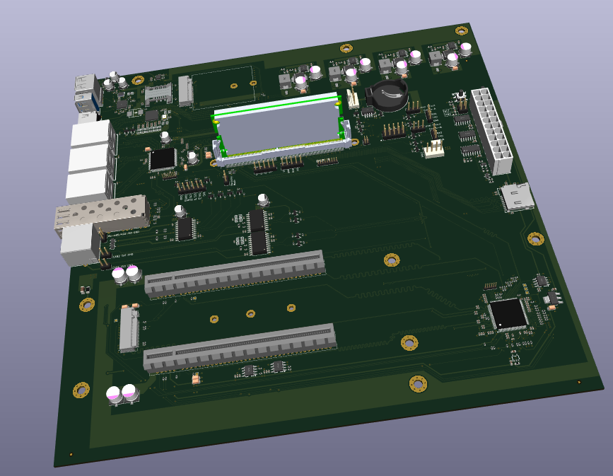
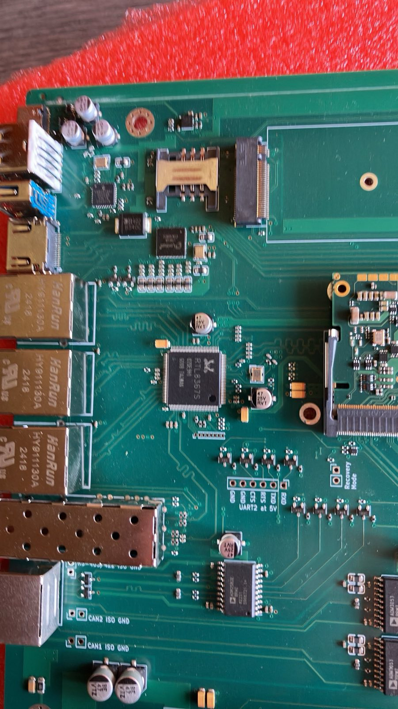
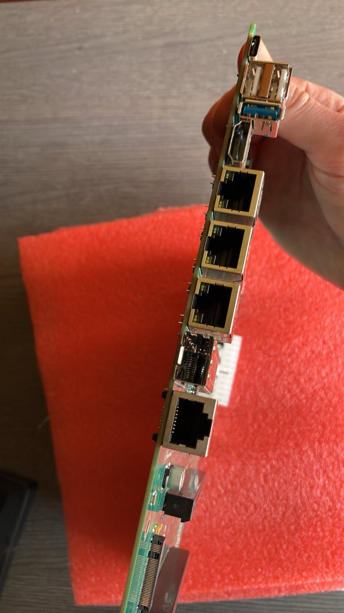
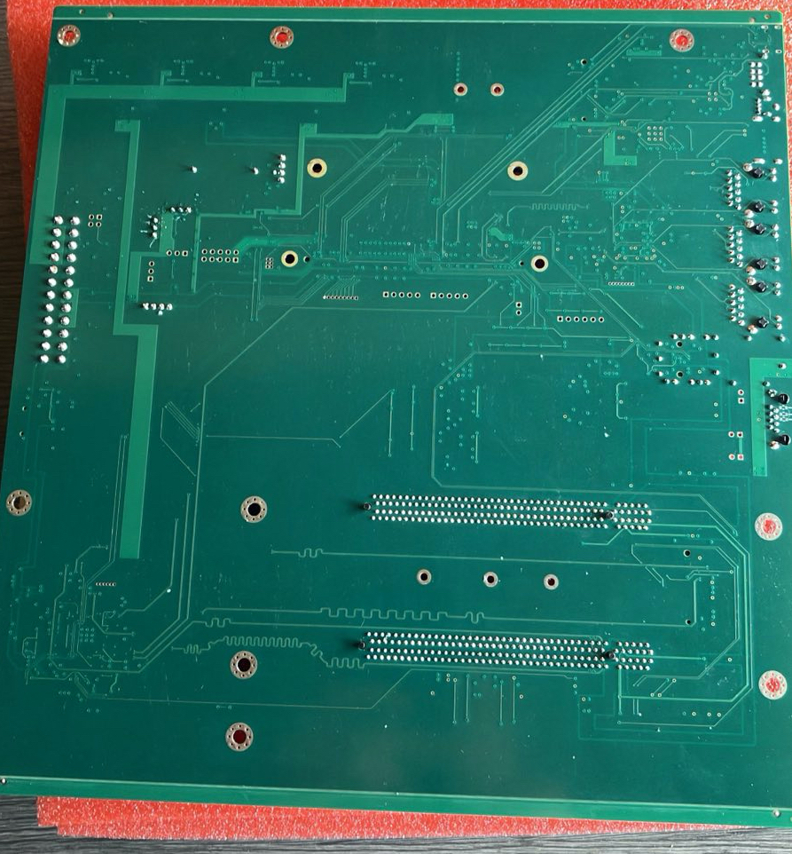
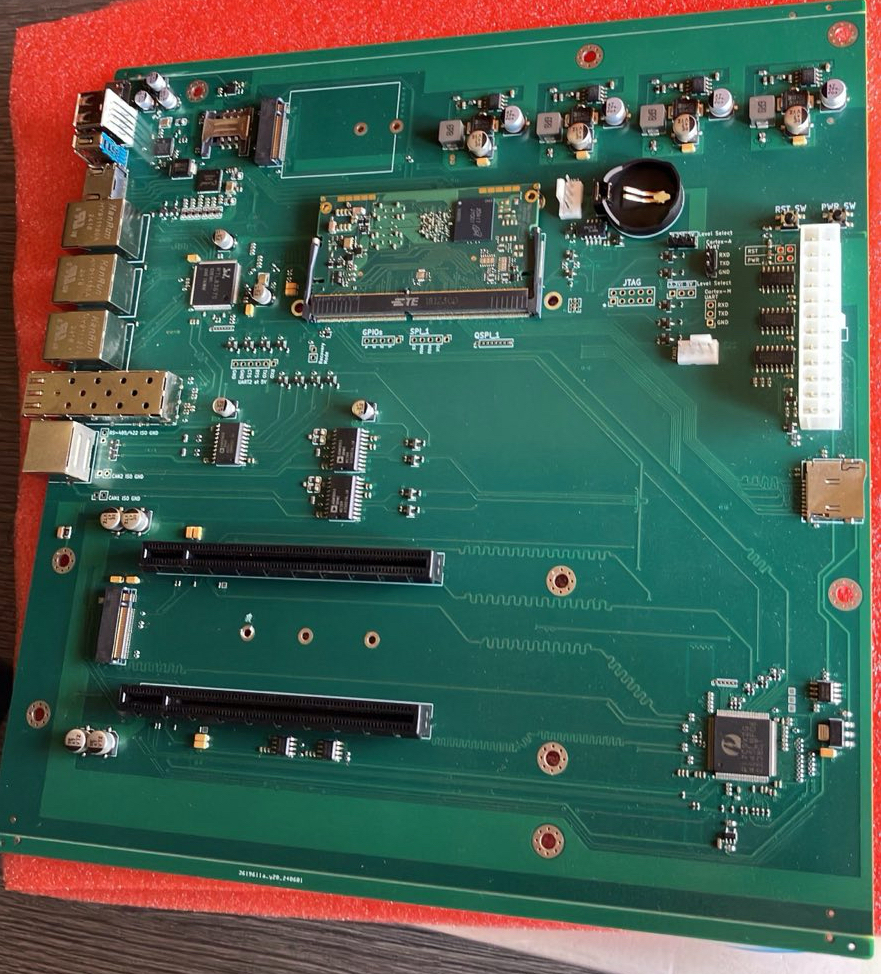
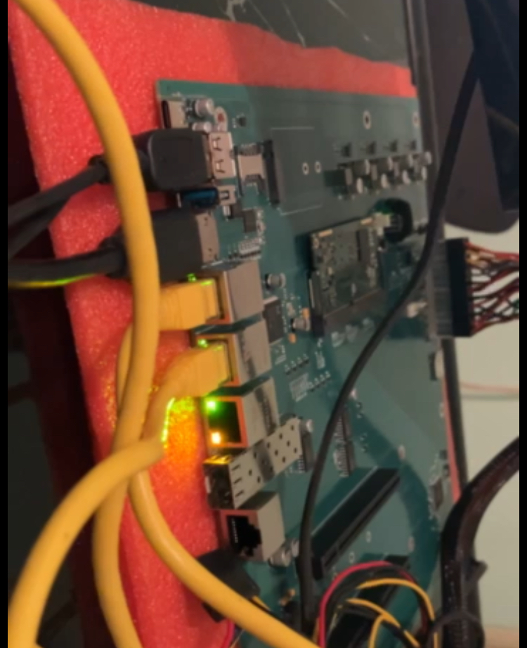
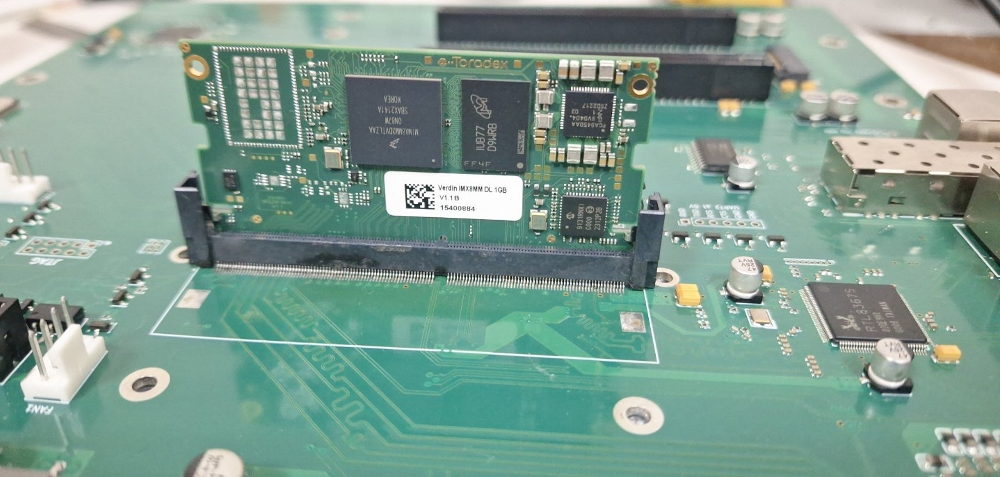
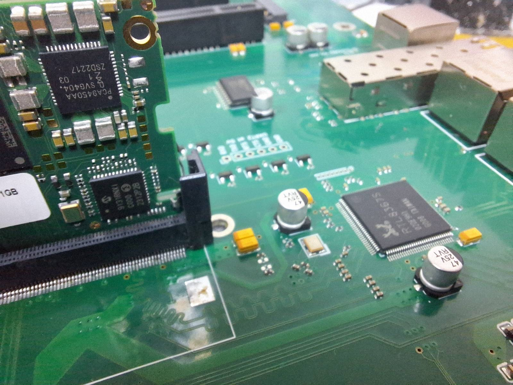
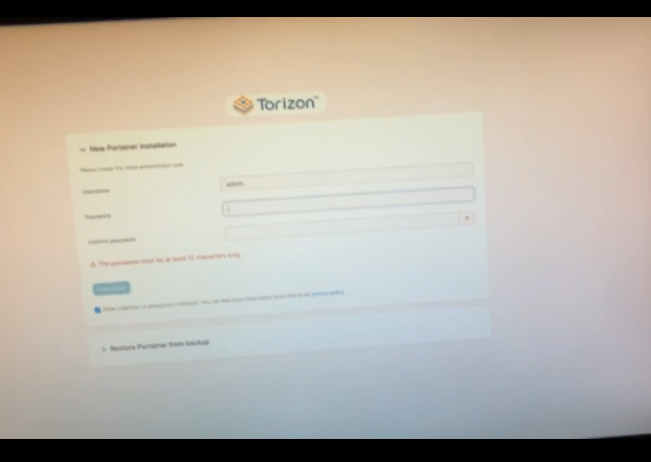

# Tangenta
Micro ATX motherboard for Toradex Verdin iMX8M Mini

# Alternative Idea
To be used a base for developing a Raspberry PI CM5 compute motherboard...

# Project Features

## USB Hub Integration
- 3x USB ports exposed on the rear panel - for mouse, keyboard, storage drive
- One of the USB ports connects to an M.2 slot with a SIM card (for a mobile modem)

## HDMI Output
- HDMI support via Lontium

## Ethernet Connectivity
- Realtek Ethernet switch for 1000BASE-T
- SFP 1000BASE-X

## PCIe Expansion
- 2x PCIe slots and an M.2 slot for SSD expansion, powered by a Pericom switch.
- PCIe slots are full-length x16, operating at x1 speed (Gen 2) for enhanced compatibility and performance.

## Industrial Connectivity
- 2x Isolated CAN transceivers
- 1x Isolated RS-422 (could be used as RS-485 as well)
- All of the above exposed over a single RJ-45 connector (to fit the maximum allowed ATX rear panel lenght)

# A few images

