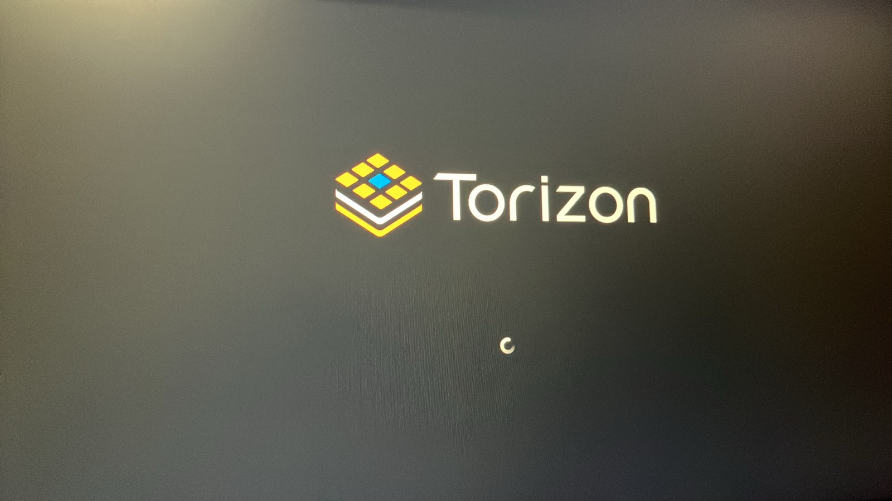

# Tangenta
Micro ATX motherboard for Toradex Verdin iMX8M Mini

# Alternative Idea
To be used as a base for developing mATX motherboards for other (similar) SoMs.

# Project Features

## USB (via Microchip hub)
- 3x USB ports exposed on the rear panel - for mouse, keyboard, storage drive
- 1x USB port connects to an M.2 slot with a SIM card (for a mobile modem)

## HDMI
- LVDS to HDMI via Lontium

## Ethernet (via Realtek switch)
- 3x RJ-45 with integrated magnetics (1000BASE-T)
- 1x SFP (1000BASE-X)

## PCIe (via Pericom switch)
- 2x PCIe slots (full-length x16, operating at x1 speed, Gen 2)
- 1x M.2 slot for SSD expansion (operating at x1 speed, Gen 2)

## Industrial Connectivity
- 2x Isolated CAN transceivers
- 1x Isolated RS-422 (could be used as RS-485 as well)
- All of the above exposed over a single RJ-45 connector (to fit the maximum allowed ATX rear panel lenght)

# A few images

